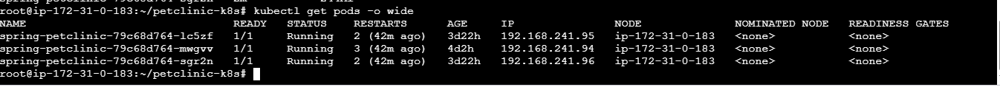
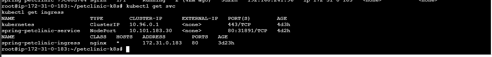
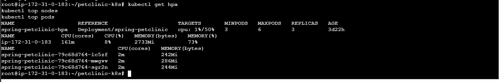

# Spring PetClinic - Kubernetes DevOps Deployment

## Project Overview

This project demonstrates the deployment of the Spring PetClinic application using Docker, Jenkins CI/CD, and Kubernetes on an AWS EC2 instance.

The project covers:

- Docker containerization
- Jenkins CI/CD pipeline
- Maven application build
- Docker image creation and publishing
- Kubernetes Deployment
- Kubernetes Service
- NGINX Ingress
- Horizontal Pod Autoscaling (HPA)
- Kubernetes resource monitoring using Metrics Server
- Application deployment and verification on AWS EC2

---

## Architecture

```text
Developer
   |
   | Git Push
   v
GitHub
   |
   v
Jenkins CI/CD
   |
   | Maven Build
   | Docker Build
   v
Docker Image
   |
   v
Docker Hub
   |
   v
Kubernetes Cluster
   |
   +-------------------------+
   |                         |
   v                         v
Deployment              NGINX Ingress
   |                         |
   |                         v
   |                  Kubernetes Service
   |                         |
   +------------+------------+
                |
                v
        Spring PetClinic Pods
                |
                v
             Port 8080
```

---

## Kubernetes Deployment

The application is deployed using a Kubernetes Deployment with 3 replicas.

### Resources

- CPU Request: `200m`
- CPU Limit: `1`
- Memory Request: `512Mi`
- Memory Limit: `1Gi`
- Liveness probe
- Readiness probe
- Rolling update strategy

The deployment provides multiple application pods for availability and allows Kubernetes to replace failed pods automatically.

---

## Kubernetes Service

The application is exposed through a Kubernetes Service.

```text
Kubernetes Service
        |
        | Port 80
        v
Spring PetClinic Pods
        |
        | Target Port 8080
        v
Spring PetClinic Application
```

---

## NGINX Ingress

NGINX Ingress Controller is used to route HTTP traffic to the Spring PetClinic Kubernetes Service.

```text
Internet
   |
   v
NGINX Ingress
   |
   v
Spring PetClinic Service
   |
   v
Spring PetClinic Pods
```

---

## Horizontal Pod Autoscaling

Horizontal Pod Autoscaler (HPA) is configured to automatically scale the application based on CPU utilization.

### HPA Configuration

- Minimum replicas: `3`
- Maximum replicas: `6`
- CPU target: `50%`

The HPA uses Kubernetes Metrics Server to obtain CPU utilization metrics.

---

## Kubernetes Resource Monitoring

Metrics Server is configured for Kubernetes resource monitoring.

Example commands:

```bash
kubectl top nodes
kubectl top pods
```

Example application pod metrics:

```text
NAME                               CPU(cores)   MEMORY(bytes)
spring-petclinic-79c68d764-lc5zf   2m           242Mi
spring-petclinic-79c68d764-mwgvv   2m           286Mi
spring-petclinic-79c68d764-sgr2n   2m           244Mi
```

---

## Jenkins CI/CD Pipeline

The Jenkins pipeline automates the application build and Kubernetes deployment.

Pipeline flow:

```text
Checkout
   |
   v
Maven Build
   |
   v
Docker Build
   |
   v
Docker Image
   |
   v
Docker Hub
   |
   v
Kubernetes Deployment
   |
   v
Deployment Verification
```

The Jenkins pipeline is defined in the `Jenkinsfile` stored in this repository.

---

## Technologies Used

| Technology | Purpose |
|---|---|
| GitHub | Source code management |
| Jenkins | CI/CD automation |
| Maven | Application build |
| Docker | Containerization |
| Docker Hub | Container image registry |
| Kubernetes | Container orchestration |
| NGINX Ingress | HTTP traffic routing |
| HPA | Automatic pod scaling |
| Metrics Server | Resource monitoring |
| AWS EC2 | Kubernetes infrastructure |
| kubectl | Kubernetes administration |
| Spring Boot | Application framework |

---

## Kubernetes Files

| File | Purpose |
|---|---|
| `deployment.yaml` | Kubernetes application deployment |
| `service.yaml` | Kubernetes Service |
| `ingress.yaml` | NGINX Ingress configuration |
| `hpa.yaml` | Horizontal Pod Autoscaler |
| `Jenkinsfile` | Jenkins CI/CD pipeline |
| `.gitignore` | Git ignore configuration |

---

## Useful Kubernetes Commands

### Check Pods

```bash
kubectl get pods -o wide
```

### Check Deployment

```bash
kubectl get deployment
```

### Check Services

```bash
kubectl get svc
```

### Check Ingress

```bash
kubectl get ingress
```

### Check HPA

```bash
kubectl get hpa
```

### Check Node Resources

```bash
kubectl top nodes
```

### Check Pod Resources

```bash
kubectl top pods
```

### Describe a Pod

```bash
kubectl describe pod <POD_NAME>
```

---

## Screenshots

### Kubernetes Pods



### Service and Ingress



### HPA Metrics



### Application Running


---

## Project Outcome

This project demonstrates a complete DevOps deployment workflow:

```text
GitHub
   ↓
Jenkins CI/CD
   ↓
Maven Build
   ↓
Docker
   ↓
Docker Hub
   ↓
Kubernetes
   ↓
NGINX Ingress
   ↓
Spring PetClinic
   ↓
HPA + Metrics Server
```

### Skills Demonstrated

- CI/CD with Jenkins
- Docker containerization
- Kubernetes deployment and administration
- AWS EC2 infrastructure
- Kubernetes Services
- NGINX Ingress
- Horizontal Pod Autoscaling
- Metrics Server monitoring
- Maven application builds
- Docker Hub image management
- Kubernetes troubleshooting and verification
